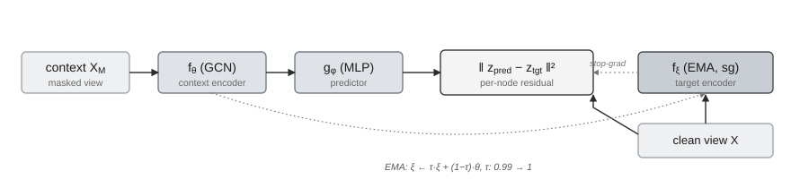

# The architecture

PolyJEPA holds one architecture fixed and varies only the pair design. This page
covers the shared mechanism.

## What a JEPA is

A Joint-Embedding Predictive Architecture (LeCun, 2022; Assran et al., 2023) learns
by predicting the **latent representation** of part of an input from another part,
rather than reconstructing raw features. Predicting in latent space lets the model
discard unpredictable low-level detail and focus on structure.

## The three networks

<figure markdown="span">
  { width="760" }
  <figcaption>The architecture is fixed across every probe. Solid arrows are the forward pass; the dotted arrow is the EMA update of the target encoder.</figcaption>
</figure>

Each probe trains the same three networks on the same graph $G=(V,E,X)$:

- a **context encoder** $f_\theta$, a two-layer GCN, which reads a *corrupted* view
  of the graph where some node features are replaced by a learnable mask token;
- a **target encoder** $f_\xi$, an exponential moving average (EMA) copy of
  $f_\theta$ with stop-gradient, which reads the *clean* graph;
- a small **predictor** $g_\phi$ that maps context embeddings into the target space.

## The loss and the score

Over the focal set $F$ (the nodes scored at a step), the pretext loss and the
per-node score $C(v)$ accumulated over the sweeps in which $v$ was focal are

$$
\mathcal{L} = \frac{1}{|F|}\sum_{v\in F}\Big\lVert\, g_\phi\big(f_\theta(X_M,E)\big)[v] - \operatorname{sg}\!\big(\operatorname{pool}(f_\xi(X,E)[\mathcal{T}(v)])\big)\Big\rVert_2^2,
\qquad
C(v) = \frac{1}{n_v}\sum_{t:\,v\in F_t} r_t(v).
$$

Here $\mathcal{T}(v)$ is the set of target nodes $v$ must predict (mean-pooled),
$\operatorname{sg}$ is stop-gradient, and $r_t(v)$ is the residual at step $t$. A
high $C(v)$ means $v$ is unpredictable under that probe's objective.

## Why it does not collapse

A predictive objective could cheat by mapping every node to a constant. PolyJEPA
prevents this the way BGRL (Thakoor et al., 2022) and I-JEPA do:

1. **stop-gradient** on the target encoder;
2. an **EMA target** whose momentum is scheduled from $0.99$ toward $1$ (a target
   that moves too fast is the main cause of collapse);
3. the **predictor on the online branch only**;
4. **BatchNorm** in the encoder, which centers the embeddings.

The target encoder's BatchNorm runs with **batch statistics** (the same view it
encodes), not running statistics. This matters because a probe's context view can
mask a large fraction of the graph (B masks every 1-hop neighbor, D the whole 2-hop
ring): running statistics gathered on that masked context view, if applied to the
clean target view, push the target's normalization far off and the embeddings
explode. Batch-statistic normalization keeps the online and target branches
consistent and removes that failure mode.

Training logs the embedding standard deviation; `Diagnostics.healthy()` confirms it
stays within a healthy band: above a floor (no collapse to a constant) **and** below
a ceiling, with the loss not blowing up (no divergence). See
[`JEPAEngine`](../reference/engine.md).

## Pluggable backbone

The encoder is swappable: GCN (default), GraphSAGE, GAT, or a structure-free MLP.
The MLP backbone is a useful control: comparing it against GCN separates how much of
a probe's signal comes from topology versus node features. See
[`backbones`](../reference/backbones.md).
