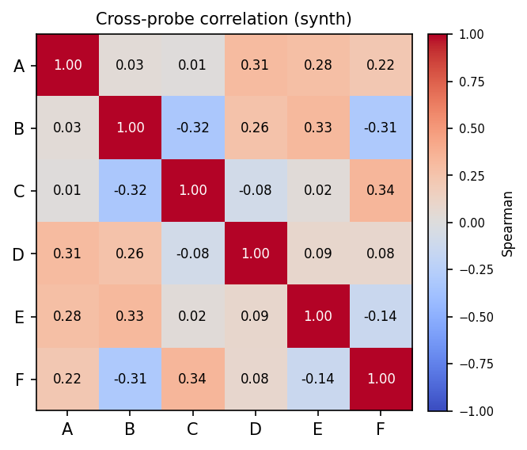

# The fingerprint

Running all probes on a graph produces its fingerprint, returned as a
[`Fingerprint`](../reference/fingerprint.md).

## Two layers

For each probe, training one JEPA yields, per node, a learned embedding and a
residual. Collected over the six probes:

- **Embedding bank** — per probe, an $N\times d$ target-encoder embedding (the
  representation of each node under that probe's objective).
- **Residual fingerprint** — an $N\times P$ matrix, one residual column per probe
  ($P=6$), with `NaN` where a node has no valid target (for example an isolated
  node under the neighborhood probes).
- **Per-graph descriptors** — per probe mean, standard deviation, skew,
  percentiles, Gini, and a pooled embedding.
- **Cross-probe matrix** — the $P\times P$ Spearman correlation between residual
  fields.

## How to read it

!!! warning "Residual magnitudes are not comparable across probes"
    Each probe is a different objective with its own latent scale, so a larger raw
    residual on one probe than another carries no meaning. Only two things are
    interpretable: the **ranking of nodes within a probe**, and the
    **rank-correlation between probes**.

Two readouts, two uses:

- the **residuals** rank nodes by surprise, for anomaly detection, difficulty
  estimation, and curriculum learning;
- the **embeddings** give per-probe node representations, for similarity and link
  prediction;
- the **cross-probe matrix** is the real product: it shows whether the six probes
  are complementary measurement axes or redundant copies.

<figure markdown="span">
  { width="460" }
  <figcaption>Cross-probe Spearman on a planted synthetic graph. Off-diagonal entries far from 1 mean the probes measure genuinely different properties.</figcaption>
</figure>

See [Interpreting the fingerprint](../guide/interpreting-the-fingerprint.md) for a
worked reading.
