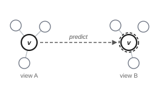
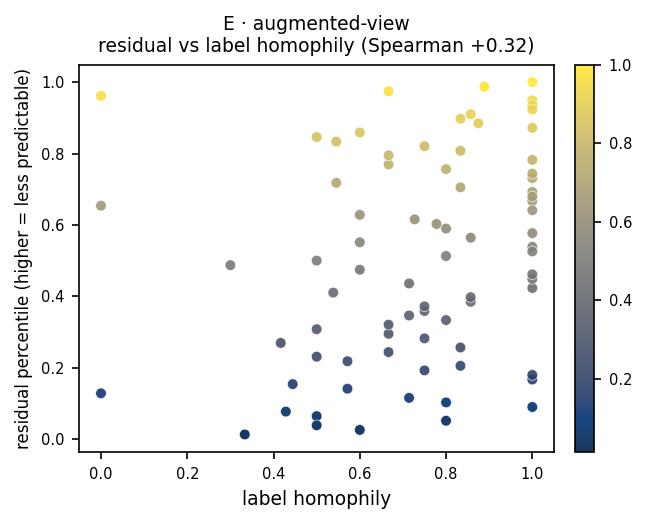

# E · augmented-view

**Measures:** intended as representational fragility under perturbation. On the
graphs tested its signal is **weak and diffuse**, so treat it as exploratory (see
below).

<figure markdown="span">
  { width="320" .bordered }
  <figcaption>No masking. Predict <em>v</em>'s embedding under augmentation B (dashed target ring) from <em>v</em> under augmentation A.</figcaption>
</figure>

## Mechanism

This probe uses no mask token. Two stochastic augmentations (edge dropping and
feature masking) produce two views; the context is view A and the target is view B,
with $\mathcal{T}(v)=\{v\}$. The residual is meant to measure how stable a node's own
embedding is under perturbation: a fragile, low-redundancy node should be less
stable.

Because the target view changes every pass, this is the one probe whose
`static_target` is `False`; the engine recomputes the target embedding each pass.

## What it tracks on real data

Honestly, on these graphs probe E is **weak and diffuse**: in the
[signature](index.md#what-each-probe-tracks) its correlations with degree,
betweenness, clustering, and k-core are all near zero, with only a mild link to
homophily and the planted outliers ($\approx +0.32$). It does not yet isolate a
clean property; the augmentation strengths likely need tuning.

<figure markdown="span">
  { width="430" }
  <figcaption>Residual percentile vs its strongest (still weak) correlate, on a planted graph.</figcaption>
</figure>

## Usage

```python
from polyjepa import JEPAEngine, AugmentedView

scores = JEPAEngine(AugmentedView(), seed=0).fit(data).score()
# augmentation strengths are configurable:
AugmentedView(feat_drop_a=0.2, edge_drop_a=0.2, feat_drop_b=0.1, edge_drop_b=0.3)
```

## API

::: polyjepa.probes.AugmentedView
