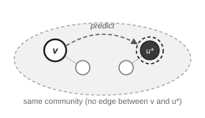
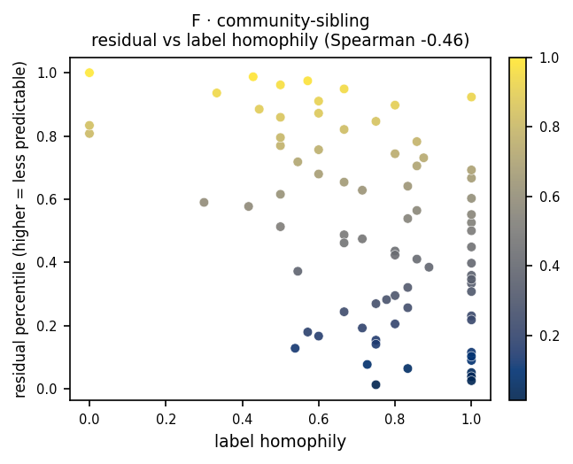

# F · community-sibling

**Measures:** community-level coherence. High residual flags community outliers and
feature-cluster mismatches.

<figure markdown="span">
  { width="320" .bordered }
  <figcaption>Predict a non-neighbor sibling <em>u*</em> in the same community (dark, dashed target ring) from <em>v</em>. <em>v</em> and <em>u*</em> share no edge.</figcaption>
</figure>

## Mechanism

A community is detected (label-free, via Louvain). For each focal node, a
non-neighbor from the same community is sampled and masked; the target is that
sibling, $\mathcal{T}(v)=\{u^*\}$. Because $v$ and $u^*$ are not adjacent, the
residual measures coherence at the community level rather than the local
neighborhood. The residual is high when a node is an outlier within its own
community.

## What it tracks on real data

This probe behaves as intended: in the
[signature](index.md#what-each-probe-tracks) its residual correlates with **low
local label homophily** (Spearman $-0.46$) and low k-core, i.e. **community
outliers**. On Cora it is nearly orthogonal to every simple centrality, consistent
with measuring a community-level property the centralities miss.

<figure markdown="span">
  { width="430" }
  <figcaption>Residual percentile vs local label homophily, on a planted graph.</figcaption>
</figure>

## Usage

```python
from polyjepa import JEPAEngine, CommunitySibling

scores = JEPAEngine(CommunitySibling(), seed=0).fit(data).score()
```

## API

::: polyjepa.probes.CommunitySibling
