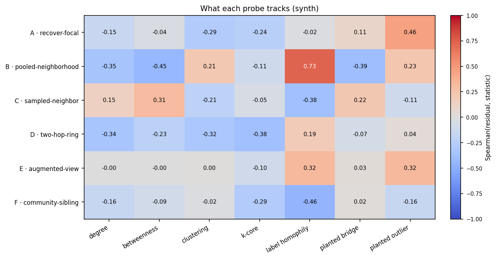
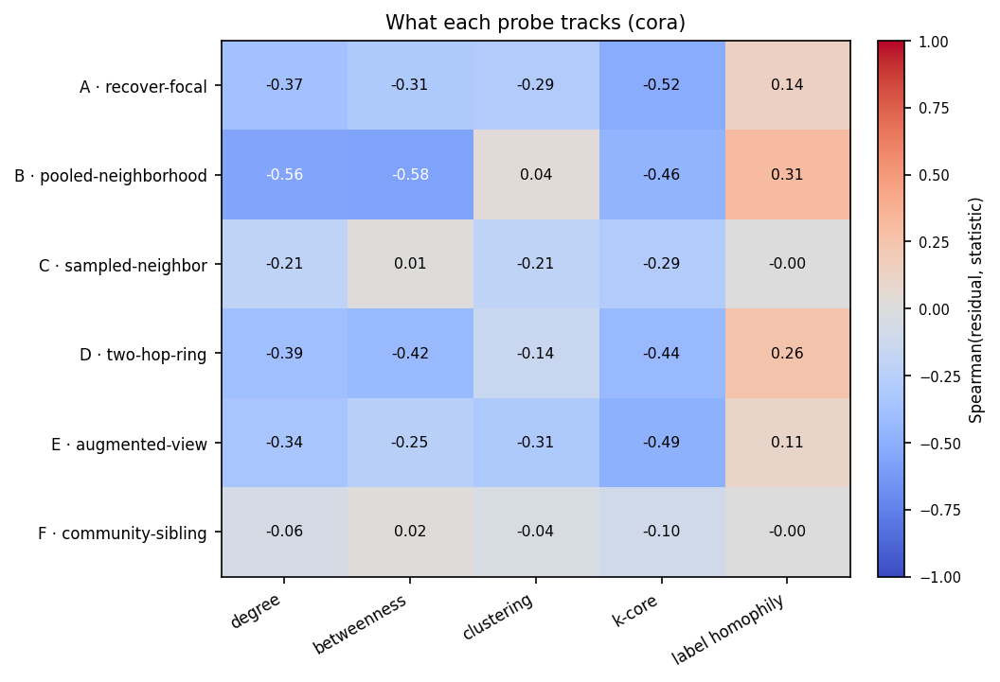

# Probes: overview

A probe is a `PairDesign`: it decides what is hidden in the context and what must
be predicted. The guiding principle is that **the context hides what it must
predict**, so a probe's residual measures how predictable one specific structural
relation is from the rest of the graph.

## Two axes

The family varies along two axes:

- **Information flow.** Predict a node from its surroundings (A), or predict the
  surroundings from a node (B, C, D, F).
- **Target granularity.** A single node (A, C, F), a pooled neighborhood (B), a
  $k$-hop ring (D), or an augmented view of the same node (E).

Probes A and E predict a node from itself, so they measure the stability of a
node's own representation. Probes B, C, D, and F predict *other* nodes, which is
what makes them distinct axes.

## The six probes

-   **A · [recover-focal](recover-focal.md)**

    Mask the focal node; predict its own embedding. High residual: isolated,
    boundary, feature/topology clash.

-   **B · [pooled-neighborhood](pooled-neighborhood.md)**

    Mask the 1-hop neighbors; predict their mean embedding. Empirically tracks
    high-homophily, low-degree interiors (see the signature below).

-   **C · [sampled-neighbor](sampled-neighbor.md)**

    Mask one neighbor; predict it (per edge). High residual: surprising edges,
    bridges, rare roles.

-   **D · [two-hop-ring](two-hop-ring.md)**

    Mask the radius-2 ring; predict it. High residual: periphery, weak clustering,
    heterophily.

-   **E · [augmented-view](augmented-view.md)**

    No mask; predict the focal across two augmentations. Weak, diffuse signal on
    these graphs (see the signature below).

-   **F · [community-sibling](community-sibling.md)**

    Mask a same-community non-neighbor; predict it. High residual: community
    outliers, cluster mismatch.

## Comparison

| Probe | Context (masked) | Target $\mathcal{T}(v)$ | High residual indicates | `static_target` | `needs_communities` |
|-------|------------------|-------------------------|-------------------------|:--:|:--:|
| A `recover-focal`       | focal $v$ ($+$opt. neighbors) | $v$'s own embedding   | isolated, boundary, clash       | yes | no |
| B `pooled-neighborhood` | 1-hop neighbors               | mean of 1-hop          | high-homophily, low-degree interiors | yes | no |
| C `sampled-neighbor`    | one sampled neighbor          | that neighbor (per edge) | surprising edges, bridges (betweenness) | yes | no |
| D `two-hop-ring`        | radius-2 ring                 | pooled 2-hop ring      | periphery, low k-core           | yes | no |
| E `augmented-view`      | none (two augmentations)      | $v$ under other view   | weak, diffuse signal            | no  | no |
| F `community-sibling`   | same-community non-neighbor   | that sibling           | community outliers              | yes | yes |

!!! note "Reading the schematics"
    On each probe page: a white node is **visible**, a dark node marked is
    **masked**, a dashed ring marks the **prediction target**, and a bold-outlined
    **v** is the focal node.

## What each probe tracks

The clearest evidence of what a probe measures is the correlation of its residual
with interpretable node statistics (degree, betweenness, clustering, k-core, local
label-homophily). The rows below are distinct, which is the point: each probe
tracks a different combination, so the fingerprint has real axes rather than six
copies of one signal.

<figure markdown="span">
  { width="760" }
  <figcaption>Spearman correlation between each probe's residual and node statistics, on a planted graph (so we can also include the planted bridges and outliers). A detects the planted feature outliers; C tracks betweenness, i.e. bridges; D tracks periphery (low k-core, low degree); F tracks low community homophily, i.e. community outliers. B tracks high-homophily, low-betweenness interiors, and E is weak and diffuse here.</figcaption>
</figure>

On the real Cora graph (computed statistics only) several probes pick up a degree
and k-core axis, while C (per-edge surprise) and F (community outlier) are nearly
orthogonal to all of these, consistent with them measuring something the simple
centralities do not.

<figure markdown="span">
  { width="660" }
  <figcaption>The same signature computed on Cora.</figcaption>
</figure>

These are honest correlations from real training runs (see
`docs/scripts/generate_figures.py`), not hand-picked: A, C, D, and F line up with
their intended properties; B and E do not match the original intuition and are
described as they actually behave.
