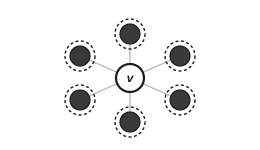
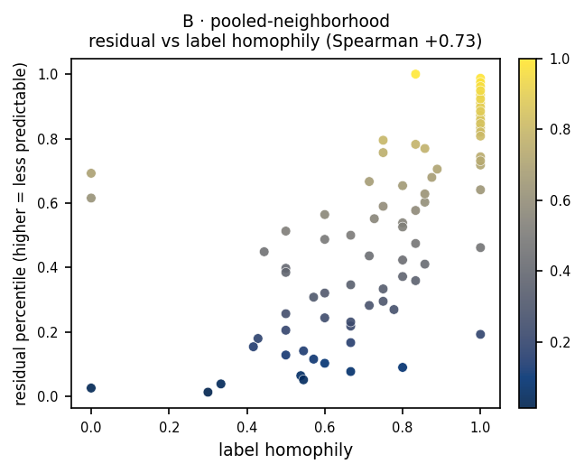

# B · pooled-neighborhood

**Measures:** how predictable a node's 1-hop neighborhood is. On the graphs tested,
its residual tracks high-homophily, low-degree interiors (not the "atypical node"
intuition we first expected, see below).

<figure markdown="span">
  { width="300" .bordered }
  <figcaption>Keep <em>v</em> visible; mask its 1-hop neighbors (dark) and predict their pooled embedding (dashed target rings).</figcaption>
</figure>

## Mechanism

The focal node stays visible while its 1-hop neighbors are masked in the context.
The target is the mean of the neighbors' clean embeddings,
$\mathcal{T}(v)=\mathcal{N}(v)$. The residual measures how predictable a node's own
neighborhood is from the rest of the graph.

## What it tracks on real data

We first expected this to flag nodes *atypical* for their neighborhood. The data
says otherwise, and we report it honestly: in the
[signature](index.md#what-each-probe-tracks) probe B's residual correlates
**positively** with label homophily (Spearman $+0.73$ on the planted graph,
$+0.31$ on Cora) and negatively with degree and betweenness. So it is highest for
**homogeneous, low-degree, interior** nodes, the opposite of the original intuition.

<figure markdown="span">
  { width="430" }
  <figcaption>Residual percentile vs local label homophily, on a planted graph.</figcaption>
</figure>

## Usage

```python
from polyjepa import JEPAEngine, PooledNeighborhood

scores = JEPAEngine(PooledNeighborhood(), seed=0).fit(data).score()
```

!!! note
    Isolated nodes have no neighbors, so this probe leaves them unscored (`NaN`).

## API

::: polyjepa.probes.PooledNeighborhood
