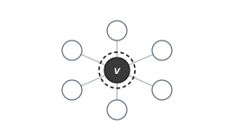
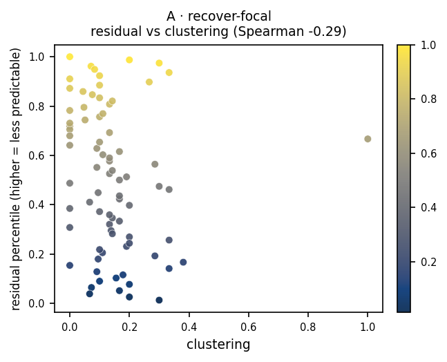

# A · recover-focal

**Measures:** how recoverable a node is from its surroundings. High residual flags
isolated, boundary, or feature/topology-clashing nodes.

<figure markdown="span">
  { width="300" .bordered }
  <figcaption>Mask the focal node <em>v</em> (dark); predict its own clean embedding (dashed target ring) from its visible neighbors.</figcaption>
</figure>

## Mechanism

The focal node $v$ has its features replaced by the mask token, and optionally a
fraction of its $k$-hop neighbors too. The context encoder must reconstruct $v$'s
clean target embedding from the remaining context, so $\mathcal{T}(v)=\{v\}$. The
residual is high when a node's own representation cannot be inferred from its
neighborhood: it sits on a boundary, or its features disagree with its topology.

This is the canonical recover-from-context signal. The optional neighbor masking
(`neighbor_mask_ratio`, `neighbor_hops`) stresses recoverability under a degraded
context.

## What it tracks on real data

In the [probe-by-property signature](index.md#what-each-probe-tracks), probe A is
the one that lines up with the planted **feature outliers** (Spearman $+0.46$): the
nodes whose own features clash with their structural context.

<figure markdown="span">
  { width="430" }
  <figcaption>Residual percentile against the continuous statistic probe A correlates with most strongly, on a planted graph.</figcaption>
</figure>

## Usage

```python
from polyjepa import JEPAEngine, RecoverFocal

scores = JEPAEngine(RecoverFocal(), seed=0).fit(data).score()
# or masked-context variants:
RecoverFocal(neighbor_mask_ratio=0.5, neighbor_hops=2)
```

## API

::: polyjepa.probes.RecoverFocal
