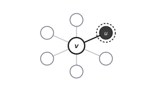
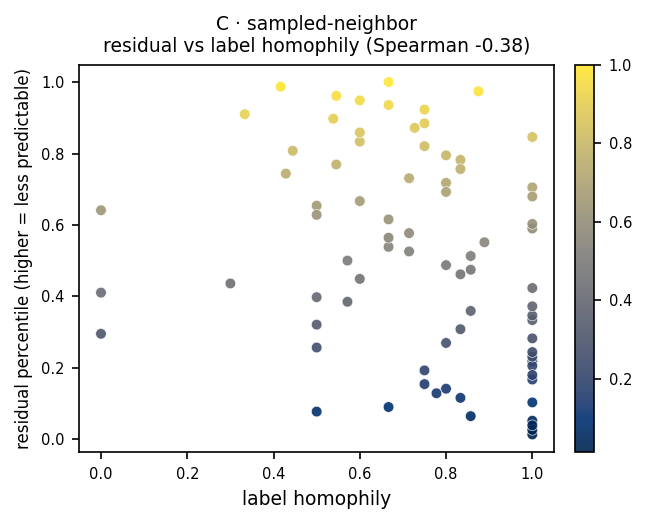

# C · sampled-neighbor

**Measures:** edge-level surprise. High residual flags surprising edges, bridges,
and rare structural roles.

<figure markdown="span">
  { width="300" .bordered }
  <figcaption>Keep <em>v</em> visible; mask one sampled neighbor <em>u</em> (dark) and predict it (dashed target ring). A per-edge residual.</figcaption>
</figure>

## Mechanism

For each focal node, one neighbor $u$ is sampled and masked; the target is that
single neighbor's embedding, $\mathcal{T}(v)=\{u\}$. This is a per-edge signal: it
asks how predictable a particular neighbor is from the focal node. The residual is
high when a node's edges are surprising, for example a bridge whose neighbors come
from a different community.

## What it tracks on real data

This probe behaves as intended: in the
[signature](index.md#what-each-probe-tracks) its residual correlates with
**betweenness** (Spearman $+0.31$) and with low label homophily ($-0.38$), i.e.
**bridges and boundary nodes**. On Cora it is nearly orthogonal to the simple
centralities, consistent with a per-edge signal the centralities do not capture.

<figure markdown="span">
  { width="430" }
  <figcaption>Residual percentile vs local label homophily, on a planted graph.</figcaption>
</figure>

## Usage

```python
from polyjepa import JEPAEngine, SampledNeighbor

scores = JEPAEngine(SampledNeighbor(), seed=0).fit(data).score()
```

## API

::: polyjepa.probes.SampledNeighbor
