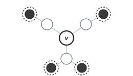
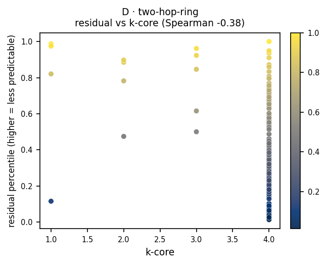

# D · two-hop-ring

**Measures:** mid-range structure. High residual flags peripheral, weakly clustered,
or heterophilic nodes.

<figure markdown="span">
  { width="300" .bordered }
  <figcaption>Keep the local ball visible; mask the radius-2 ring (dark) and predict its pooled embedding (dashed target rings).</figcaption>
</figure>

## Mechanism

The radius-2 ring (nodes exactly two hops away) is masked and predicted as a pooled
target, $\mathcal{T}(v)=\text{ring}_2(v)$. The residual measures how predictable a
node's mid-range surroundings are from its immediate context. The residual is high
when a node sits on the periphery, is weakly clustered, or its two-hop neighborhood
is heterophilic.

!!! info "Implementation note"
    The probe masks the radius-2 ring as its target rather than restricting the
    context to exactly the radius-1 ball. On dense, strongly homophilic graphs the
    ring saturates the community, so this probe is most informative on sparser or
    heterophilic structure.

## What it tracks on real data

This probe behaves as intended: in the
[signature](index.md#what-each-probe-tracks) its residual correlates negatively with
**k-core** (Spearman $-0.38$), degree, and clustering, i.e. it is highest on
**peripheral, weakly embedded** nodes. The pattern holds on Cora.

<figure markdown="span">
  { width="430" }
  <figcaption>Residual percentile vs k-core (periphery), on a planted graph.</figcaption>
</figure>

## Usage

```python
from polyjepa import JEPAEngine, TwoHopRing

scores = JEPAEngine(TwoHopRing(), seed=0).fit(data).score()
```

## API

::: polyjepa.probes.TwoHopRing
